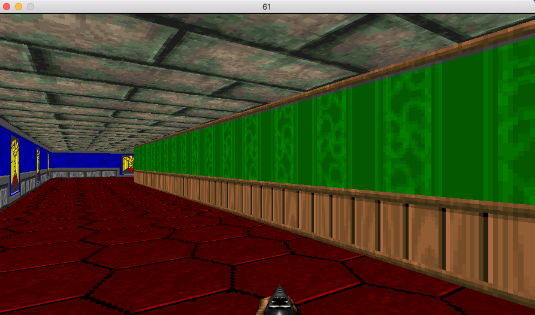

# Wolf3D

This project is my first step in the game dev universe !
Entirely made in C with SDL2 using my own standard C library.
The game is limited to 60 FPS.

## Usage

Compile using make and run with ./wolf3d

## Preview

## Keyboard shortcuts

<table width="100%">
<thead>
<tr>
<td width="65%" height="60px" align="center" cellpadding="0">
<strong>Description</strong>
</td>
<td width="10%" align="center" cellpadding="0">
&nbsp;<strong>Key(s)</strong>&nbsp;
</td>
</tr>
</thead>
<tbody>
<tr>
<td valign="top" height="30px">Close the program (aka quit/exit)</td>
<td valign="top" align="center"><kbd>&nbsp;esc&nbsp;</kbd></td>
</tr>
<tr>
<td valign="top" height="30px">Reset all the changes made for this map</td>
<td valign="top" align="center"><kbd>&nbsp;clear&nbsp;</kbd></td>
</tr>
<tr>
<td valign="top" height="30px">Change the display gradient (aka change color)</td>
<td valign="top" align="center"><kbd>&nbsp;shift&nbsp;</kbd></td>
</tr>
<tr>
<td valign="top" height="30px">Enable or disable the mouse controls</td>
<td valign="top" align="center"><kbd>&nbsp;M&nbsp;</kbd> or <kbd>&nbsp;S&nbsp;</kbd></td>
</tr>
<tr>
<td valign="top" height="30px">Increase the global size of the fractal (aka zoom)</td>
<td valign="top" align="center"><kbd>&nbsp;+&nbsp;</kbd></td>
</tr>
<tr>
<td valign="top" height="30px">Decrease the global size of the fractal (aka unzoom)</td>
<td valign="top" align="center"><kbd>&nbsp;-&nbsp;</kbd></td>
</tr>
<tr>
<td valign="top" height="30px">Move the fractal to the up (aka move up)</td>
<td valign="top" align="center"><kbd>&nbsp;▲&nbsp;</kbd></td>
</tr>
<tr>
<td valign="top" height="30px">Move the fractal to the down (aka move down)</td>
<td valign="top" align="center"><kbd>&nbsp;▼&nbsp;</kbd></td>
</tr>
<tr>
<td valign="top" height="30px">Move the fractal to the left (aka width move left)</td>
<td valign="top" align="center"><kbd>&nbsp;◄&nbsp;</kbd></td>
</tr>
<tr>
<td valign="top" height="30px">Move the fractal to the right (aka move right)</td>
<td valign="top" align="center"><kbd>&nbsp;►&nbsp;</kbd></td>
</tr>
<tr>
<td valign="top" height="30px">Increase the number of iterations</td>
<td valign="top" align="center"><kbd>&nbsp;W&nbsp;</kbd></td>
</tr>
<tr>
<td valign="top" height="30px">Decrease the numbre of iterations</td>
<td valign="top" align="center"><kbd>&nbsp;Q&nbsp;</kbd></td>
</tr>
<tr>
<td valign="top" height="30px">Clockwise rotation on the Z axe</td>
<td valign="top" align="center"><kbd>&nbsp;T&nbsp;</kbd></td>
</tr>
<tr>
<td valign="top" height="30px">Counter clockwise rotation on the Z axe</td>
<td valign="top" align="center"><kbd>&nbsp;R&nbsp;</kbd></td>
</tr>
<tr>
<td valign="top" height="30px">Display the Julia fractal</td>
<td valign="top" align="center"><kbd>&nbsp;1&nbsp;</kdb></td>
</tr>
<tr>
<td valign="top" height="30px">Display the Mandelbrot fractal</td>
<td valign="top" align="center"><kbd>&nbsp;2&nbsp;</kbd></td>
</tr>
<tr>
<td valign="top" height="30px">Display the Tricorn fractal</td>
<td valign="top" align="center"><kbd>&nbsp;3&nbsp;</kbd></td>
</tr>
</tbody>
</table>